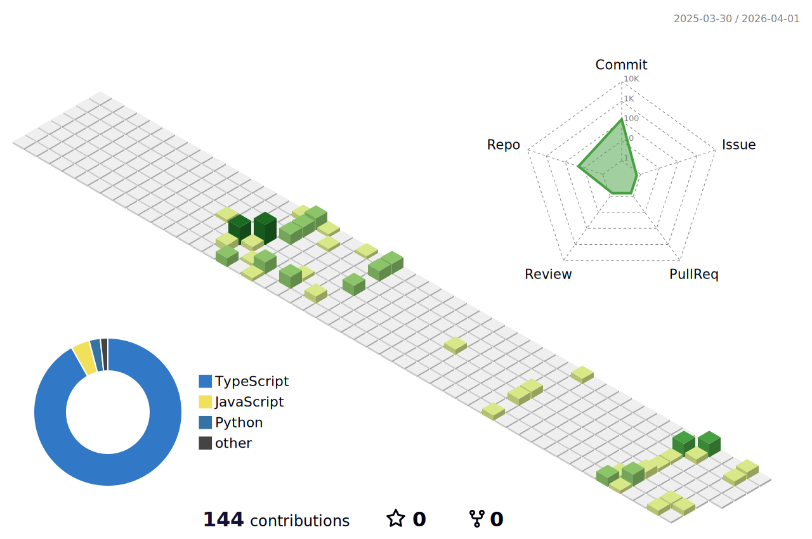

# 

<p align="left">
  <a href="https://komarev.com/ghpvc/?username=SoumadeepCh&style=for-the-badge&color=0f766e">
    
  </a>
  <a href="https://github.com/SoumadeepCh?tab=followers">
    
  </a>
  <a href="https://github.com/SoumadeepCh">
    
  </a>
</p>

## About Me

I build ambitious full-stack products across AI, workflow automation, and multi-tenant SaaS.

- I like turning complex ideas into polished, usable systems.
- My work usually sits at the intersection of product UI, backend architecture, and intelligent tooling.
- I enjoy building things that are both technically serious and fun to use.
- ♟️ **Avid Chess player** and **LeetCode enthusiast**.

<p align="left">
  <a href="https://www.linkedin.com/in/soumadeep-chatterjee-a779a4270/">
    
  </a>
  <a href="mailto:soumadeepc014@gmail.com">
    
  </a>
  <a href="https://github.com/SoumadeepCh">
    
  </a>
</p>

## What I Work On

```text
AI products           -> forensic analysis, explainability, risk scoring
Automation systems    -> DAG workflows, triggers, queues, observability
Team productivity     -> multi-tenant task platforms, dashboards, analytics
Frontend craft        -> interactive interfaces, charts, polished app flows
```

## Tech I Use

<p align="left">
  
</p>

<p align="left">
  
  
  
  
  
  
</p>

## 🚀 Featured Projects

### 🛡️ [Reality Firewall](https://github.com/SoumadeepCh/Reality-Firewall)
> *Deepfake & manipulated-media analysis platform*

- **Platform:** Multi-modal analysis for image, video, and audio with forensic-style reports for risk scoring and explainability.
- **Tech Stack:** <br/>
  
  
  
  
  
  
- **Link:** 🔗 [View Source Code](https://github.com/SoumadeepCh/Reality-Firewall)

<br>

### ⚡ [FlowSync](https://github.com/SoumadeepCh/FlowSync)
> *DAG-based workflow orchestration & automation platform*

- **Platform:** Visual workflow builder (React Flow) backed by a durable execution engine for queueing, retries, and triggers.
- **Tech Stack:** <br/>
  
  
  
  
  
  
- **Link:** 🔗 [View Source Code](https://github.com/SoumadeepCh/FlowSync)

<br>

### 🐝 [SprintHive](https://github.com/SoumadeepCh/SprintHive)
> *Multi-tenant sprint & task management platform (Jira-lite)*

- **Platform:** Organizations, projects, sprints, Kanban workflows, analytics, and team-oriented task flows.
- **Tech Stack:** <br/>
  
  
  
  
  
- **Link:** 🔗 [View Source Code](https://github.com/SoumadeepCh/SprintHive)

## GitHub Pulse

<p align="center">
  
  
</p>

<p align="center">
  
</p>

## 🧩 Beyond the Code (Interests & Stats)

When I'm taking a break from building, I keep my problem-solving skills sharp through logic and strategy. 

<div align="center">
  <a href="https://leetcode.com/SoumadeepCh/">
    
  </a>
</div>

<p align="center">
  <a href="https://leetcode.com/SoumadeepCh/">
    
  </a>
  <a href="https://www.chess.com/member/SoumadeepCh">
    
  </a>
</p>

## 🏙️ 3D Contribution City

My commits visualized as a 3D block city. The blocks build up as I push more code!

<div align="center">
  <picture>
    <source media="(prefers-color-scheme: dark)" srcset="./profile-3d-contrib/profile-night-view.svg">
    <source media="(prefers-color-scheme: light)" srcset="./profile-3d-contrib/profile-green-animate.svg">
    
  </picture>
</div>

## Reach Out

- LinkedIn: [soumadeep-chatterjee-a779a4270](https://www.linkedin.com/in/soumadeep-chatterjee-a779a4270/)
- Email: [soumadeepc014@gmail.com](mailto:soumadeepc014@gmail.com)
- GitHub: [@SoumadeepCh](https://github.com/SoumadeepCh)


